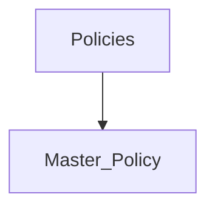

The Privileged Session Manager (PSM) is a CyberArk component that enables you to initiate, monitor, and record privileged sessions and usage of administrative and privileged accounts. It is a critical component of the CyberArk Privileged Access Manager (PAM) solution and helps to ensure that privileged access is secure and compliant.

The PSM provides the following key features:

- **Session initiation:** The PSM allows you to initiate privileged sessions to remote machines or applications.
- **Session monitoring:** The PSM allows you to monitor privileged sessions in real time.
- **Session recording:** The PSM allows you to record privileged sessions for auditing and compliance purposes.
- **Session auditing:** The PSM allows you to audit privileged sessions for compliance purposes.
- **Session isolation:** The PSM isolates privileged sessions from the end-user's desktop, which helps to protect the end-user's computer from malware and other attacks.

The PSM is a valuable tool for organizations that need to secure and monitor privileged access. It can help to protect your organization's critical systems and data from unauthorized access and malicious attacks.

Here are some of the benefits of using the Privileged Session Manager:

- **Secure privileged access:** The PSM helps to secure privileged access by isolating privileged sessions from the end-user's desktop.
- **Auditing and compliance:** The PSM helps to ensure that privileged access is compliant with organizational policies and regulations.
- **Monitoring:** The PSM allows you to monitor privileged sessions in real time, which can help you to identify and respond to security incidents quickly.
- **Recording:** The PSM allows you to record privileged sessions for auditing and compliance purposes.

If you are looking for a way to secure and monitor privileged access, the Privileged Session Manager is a valuable tool. It can help to improve the security of your organization's privileged access and reduce the risk of unauthorized access.

## What Are the Services that Are Related to Privileged Session Manager?

What are the features provided by privileged session manager

![[Pasted image 20230803111636.png]]

ID  
SubnetPolicy  
SessionRecorderSafe  
SessionRecorderSafeRetention  
MaxSessionDuration  
ShowRecordedSessionNotification  
RecordedSessionNofificationDisplayTime  
ShowLiveMonitoringNotifcation  
LiveMonitoringNotifcationDisplayTime  
DisableDualControlForPSMConnections  
EnablePriviegedSSO  
UsePersonalPassword  
ExclusiveUnlockAfterPSMSession

## How is it Recorded?

CyberArk's Privileged Session Manager (PSM) is part of CyberArk's Privileged Access Security solution. The PSM enables organizations to isolate, monitor, record, and control privileged sessions on critical assets, adding a layer of security to prevent potential threats from privileged account misuse.

Here's how sessions are recorded in the PSM for CyberArk:

1. **Isolation and Proxy**: PSM acts as a jump server or proxy, ensuring users don't connect directly to the target systems. Instead, they connect to the PSM, which then connects to the target system on their behalf.

2. **Session Initiation**: When a user initiates a privileged session through the CyberArk solution (either via the web interface or the native client), the request is routed to the PSM.

3. **Authentication and Authorization**: Before initiating the session, PSM checks with the Vault (another component of CyberArk's solution) to ensure the user is authenticated and authorized to access the target system.

4. **Real-Time Monitoring**: As the session is active, PSM can monitor it in real-time. If necessary, privileged users' activities can be immediately terminated if they are found to be violating policies.

5. **Recording**: Every action taken within the session is recorded. This includes keystrokes, mouse movements, windows opened, commands executed, and so on. 

6. **Secure Storage**: The session recordings are stored securely, ensuring they cannot be tampered with. This is crucial for audit purposes.

7. **Review and Audit**: Administrators or auditors can review recorded sessions to check for any malicious or unintended activities. This is especially useful for forensic analysis and ensuring compliance with various regulatory requirements.

8. **Metadata and Search**: Along with the session recordings, metadata about the session is also stored. This makes it easy for administrators to search for specific sessions or activities.

9. **Protection**: The recorded sessions are encrypted and protected to ensure they remain confidential and are not tampered with.

10. **Playback**: The sessions can be played back, similar to how one would watch a video, allowing for a visual verification of all activities during that session.

Having the ability to record sessions is a powerful tool for organizations to keep track of privileged activities on their critical assets. It not only provides a detailed audit trail but also acts as a deterrent for malicious insiders, knowing their actions are being recorded. 
