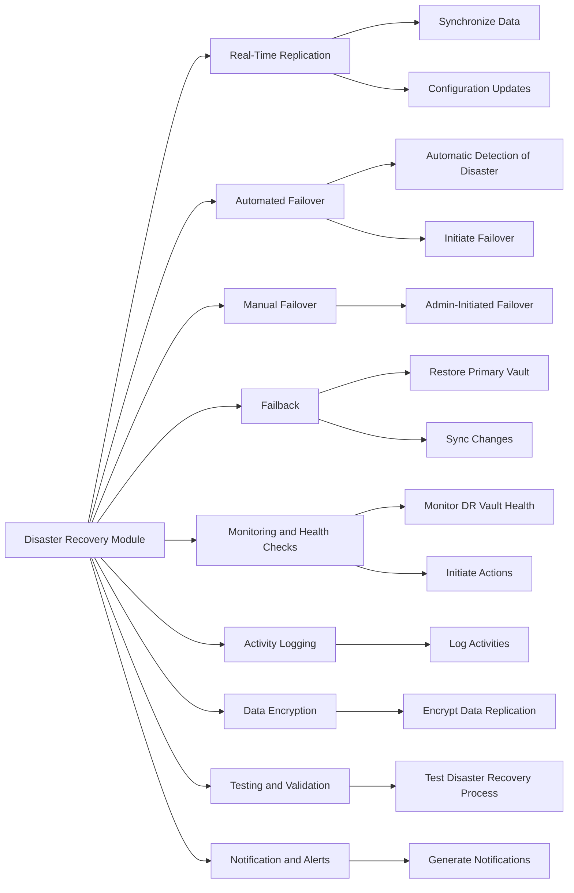
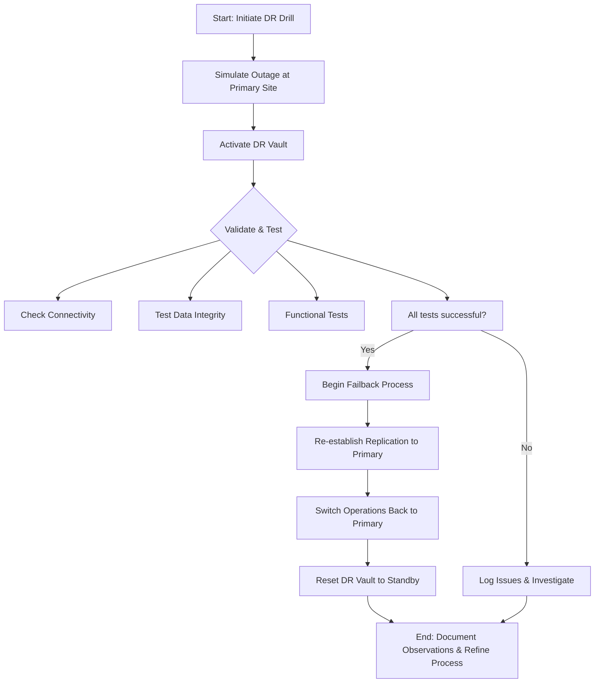
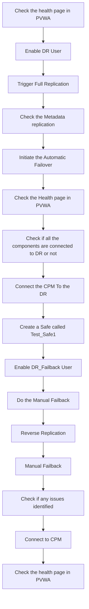
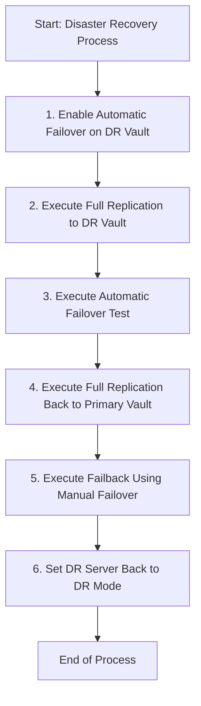
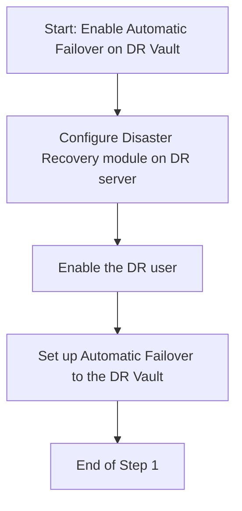
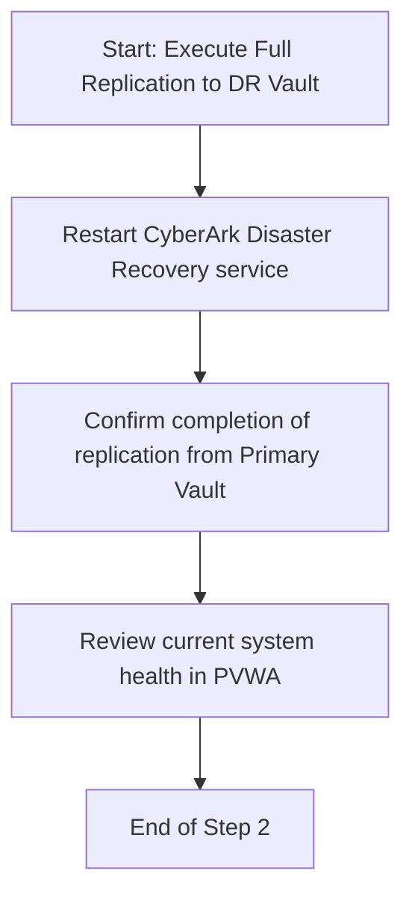
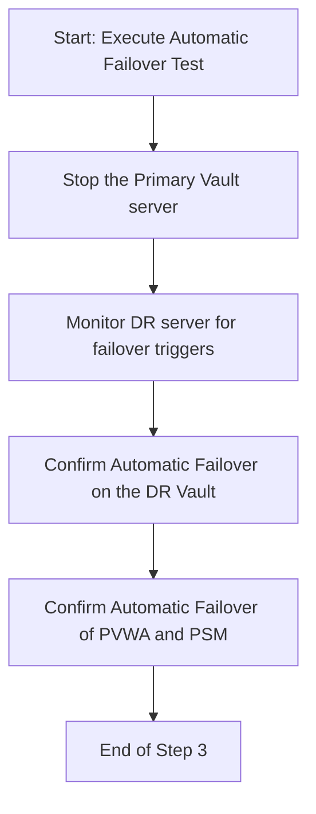
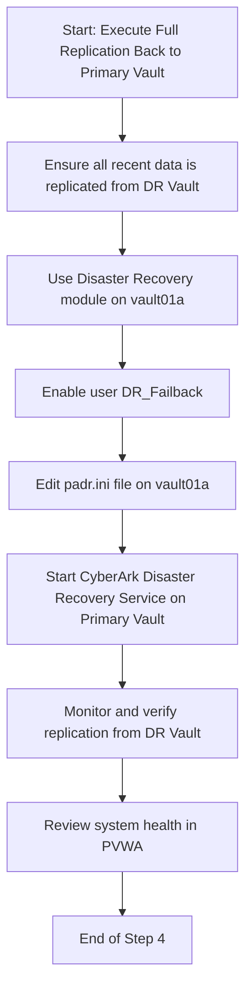
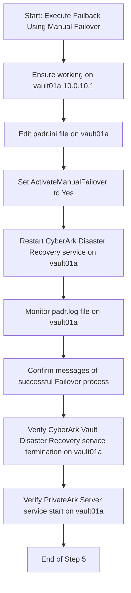
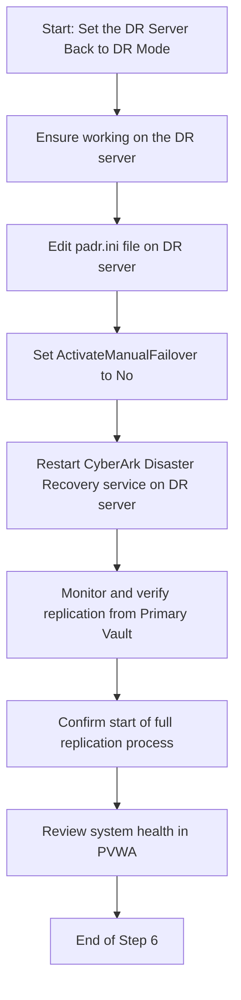

## Manual Fail Back Steps:

Before attempting the Failback steps, make sure the DR_Failback user is enabled.

1. Update the Padr.ini file in Primary Vault with `ActivateManualFailOver=No` and `FailoverMode=No`  
   And Delete the last two lines (log number and timestamp of the last successful replication) in the file.

2. Start the `CyberArkVaultDisasterRecovery` Service at primary node(You have already the PrivateArk Server service in stop status, since it is in failover state)

In Prod Padr.log we will see the `MetaDataReplication` is running successfully message.  
And the Replication will Ended after some time.

To bring back the Primary Vault Up and running to the Production State.  
update the `ActivateManualFailover=Yes` in padr.ini of Prod node and restart the CyberArk DR service.

This will automatically starts this PrivateArk Server Service, and the DisasterRecovery Service will stop automatically.

Remove the two time stamp lines at DR vault-Padr.ini and set Failover Mode=No  
Stop the PrivateArk Server service in DR Vault.  
Start the DR service at DR Vault.

## Plan of Action

1. Check the health page in PVWA.
2. Enable DR User
3. Trigger Full Replication
4. Check the Metadata replication.
5. Initiate the Automatic Failover
6. Check the Health page in PVWA
7. Check the all the components are connected to DR or not.
8. Connect the CPM To the DR.
9. Create a Safe called Test_Safe1
10. Enable DR_Failback User
11. Do the Manual Failback
	1. Reverse Replication
	1. Manual Failback
12. Check if any issues identified.
13. Connect to CPM
14. Check the health page in PVWA.

## Fail Over

### Services Before Fail Over In the DR Vault

what are all the services would be in running state.  

#### On

- CyberArk Vault Disaster Recovery  
- PrivateArk DataBase  
- CyberArk Logic Container  
- CyberArk Windows hardened firewall

#### Off

- PrivateArk Server Service  
- CyberArk Event Notification Engine

### Services After Fail over In the DR Vault

#### On

All Services except CyberArk Vault Disaster Recovery Service.

the credential file is created in the disaster recovery vault and the user will be in the primary vault.

## What Are the Right Questions in This Topics?

DR Drill flowchart

![[Pasted image 20230813155012.png]]

## Disaster Recovery Flowcharts

### Step 1

### Step 2

### Step 3

### Step 4

### Step 5

### Step 6

